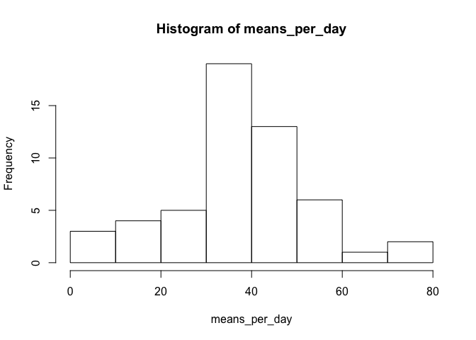
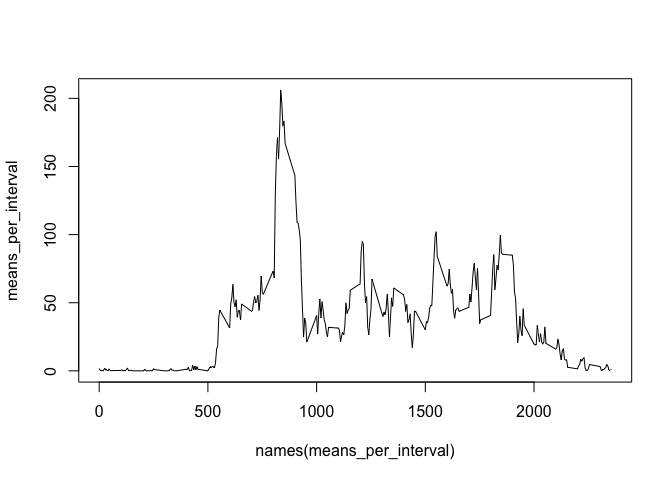
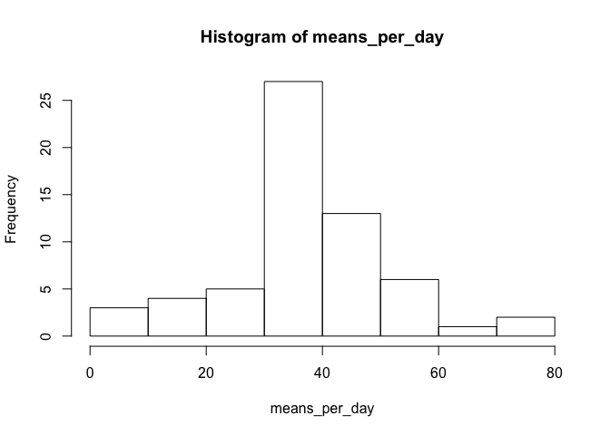
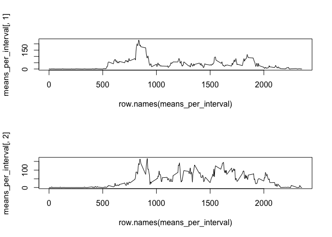

# Reproducible Research: Peer Assessment 1


## Loading and preprocessing the data

```r
unzip("activity.zip")
data <- read.csv("activity.csv")
data$date <- strptime(as.character(data$date), format = "%Y-%m-%d")
data$interval <- factor(data$interval)
```


## What is mean total number of steps taken per day?


```r
means_per_day <- tapply(data$steps, as.factor(as.character(data$date)), mean, na.rm=T)
hist(means_per_day)
```

 


```r
mean_per_day = mean(means_per_day, na.rm = T)
mean_per_day
```

```
## [1] 37.3826
```


```r
median_per_day = median(means_per_day, na.rm = T)
median_per_day
```

```
## [1] 37.37847
```

## What is the average daily activity pattern?


```r
means_per_interval <- tapply(data$steps, data$interval, mean, na.rm=T)
plot(names(means_per_interval), means_per_interval, type = "l")
```

 


```r
means_per_interval[means_per_interval == max(means_per_interval)]
```

```
##      835 
## 206.1698
```

## Imputing missing values


```r
na.count = length(which(is.na(data$steps)))
na.count
```

```
## [1] 2304
```


```r
res <- sapply(which(is.na(data$steps)), function(i) { 
    data[i,1] <<- means_per_interval[data[i,3]]
    })
na.count = length(which(is.na(data$steps)))
na.count
```

```
## [1] 0
```


```r
means_per_day <- tapply(data$steps, as.factor(as.character(data$date)), mean)
hist(means_per_day)
```

 


```r
mean_per_day = mean(means_per_day)
mean_per_day
```

```
## [1] 37.3826
```


```r
median_per_day = median(means_per_day)
median_per_day
```

```
## [1] 37.3826
```
## Are there differences in activity patterns between weekdays and weekends?


```r
data$weekday = factor(c("weekday", "weekend"))
weekdays.index <- as.numeric(format(data$date, "%u"))

res <- sapply(which(weekdays.index>5), function(i) { data[i,4] <<- "weekend" })
res <- sapply(which(weekdays.index<=5), function(i) { data[i,4] <<- "weekday" })
```


```r
means_per_interval <- sapply( split(data, data$weekday), function(l) {tapply(l$steps, l$interval, mean)})

par(mfrow = c(2, 1)) 
plot(row.names(means_per_interval), means_per_interval[,1], type = "l")
plot(row.names(means_per_interval), means_per_interval[,2], type = "l")
```

 

