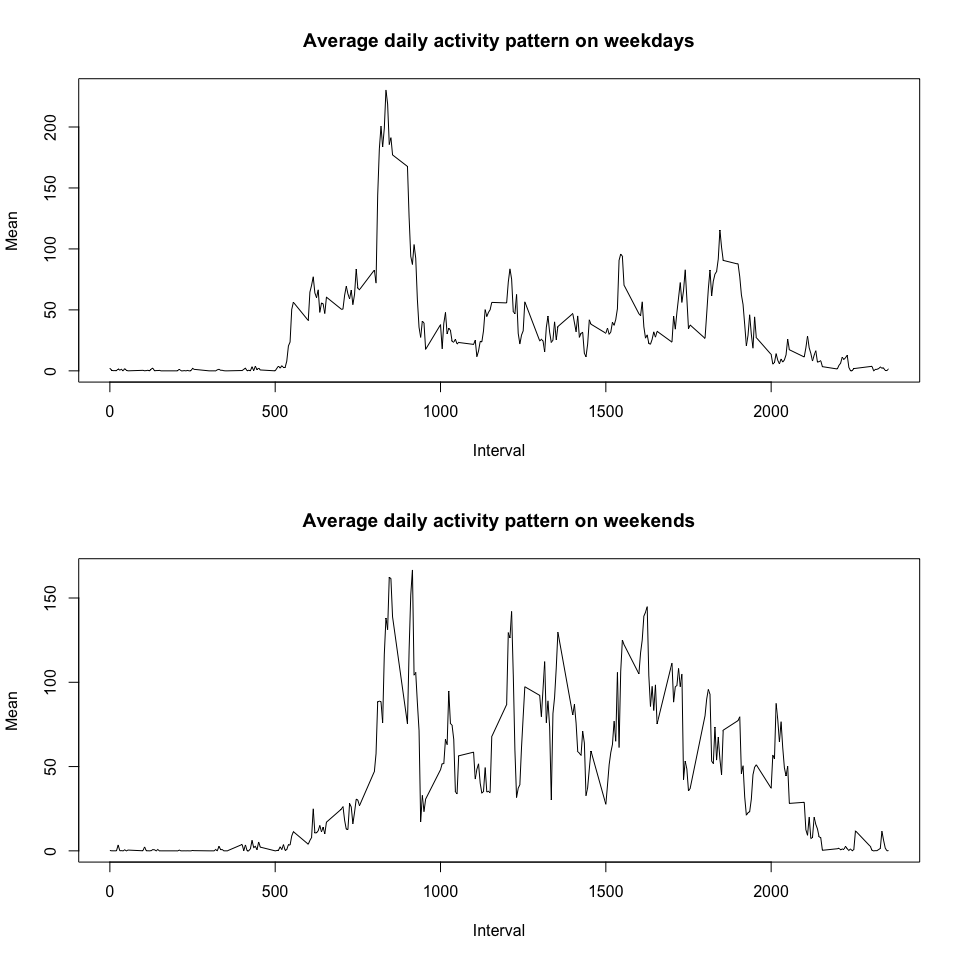

# Reproducible Research: Peer Assessment 1

## Description

This assignment makes use of data from a personal activity monitoring device. This device collects data at 5 minute intervals through out the day. The data consists of two months of data from an anonymous individual collected during the months of October and November, 2012 and include the number of steps taken in 5 minute intervals each day.


## Loading and preprocessing the data

The data is located in the `activity.zip` file. First, unzip it and load into variable called `data`:

```r
unzip("activity.zip")
data <- read.csv("activity.csv")
str(data)
```

```
## 'data.frame':	17568 obs. of  3 variables:
##  $ steps   : int  NA NA NA NA NA NA NA NA NA NA ...
##  $ date    : Factor w/ 61 levels "2012-10-01","2012-10-02",..: 1 1 1 1 1 1 1 1 1 1 ...
##  $ interval: int  0 5 10 15 20 25 30 35 40 45 ...
```
The variables included in this dataset are:  
* `steps`: Number of steps taking in a 5-minute interval (missing values are coded as `NA`)  
* `date`: The date on which the measurement was taken in `YYYY-MM-DD` format  
* `interval`: Identifier for the 5-minute interval in which measurement was taken  

So let's make some transformations of the variables:

```r
data$date <- strptime(as.character(data$date), format = "%Y-%m-%d")
data$interval <- factor(data$interval)
```
Now `date` variable contains `POSIXlt` values and `interval` variable is a factor.

## What is mean total number of steps taken per day?

The total number of steps taken per day is an vector of the means steps count for each day:  

```r
means_per_day <- tapply(data$steps, as.factor(as.character(data$date)), mean, na.rm=T)
```

We ignored `NA` values. So let's make a histogram:

```r
hist(means_per_day)
```

 

We can calculate the mean and the median of the total number of steps taken per day.


```r
mean_per_day = mean(means_per_day, na.rm = T)
mean_per_day
```

```
## [1] 37.3826
```


```r
median_per_day = median(means_per_day, na.rm = T)
median_per_day
```

```
## [1] 37.37847
```

## What is the average daily activity pattern?

Now we have to find the average daily activity pattern. For this purpose we need to calculate average steps counts for each 5-minute interval, averaged across all days.


```r
means_per_interval <- tapply(data$steps, data$interval, mean, na.rm=T)
```

And now we can make a plot:


```r
plot(names(means_per_interval), means_per_interval, type = "l")
```

 

The interval that contains the maximum number of steps is:


```r
max_interval <- means_per_interval[means_per_interval == max(means_per_interval)]
max_interval
```

```
##      835 
## 206.1698
```

So, in average a person makes most steps in interval `835`.

## Imputing missing values

Note that there are a number of days/intervals where there are missing values (coded as `NA`). The presence of missing days may introduce bias into some calculations or summaries of the data.
First let's calculate the total number of missing values in the dataset:


```r
na.count = length(which(is.na(data$steps)))
na.count
```

```
## [1] 2304
```

We use the means for that 5-minute intervals to replace `NA` values:


```r
res <- sapply(which(is.na(data$steps)), function(i) { 
    data[i,1] <<- means_per_interval[data[i,3]]
    })
na.count = length(which(is.na(data$steps)))
na.count
```

```
## [1] 0
```

Let's make a histogram as previously but with data where NA values were filled in:


```r
means_per_day <- tapply(data$steps, as.factor(as.character(data$date)), mean)
hist(means_per_day)
```

 

Calculate the mean and the median:


```r
mean_per_day = mean(means_per_day)
mean_per_day
```

```
## [1] 37.3826
```


```r
median_per_day = median(means_per_day)
median_per_day
```

```
## [1] 37.3826
```

Note that the mean equals the median. It means that distribution is symmetric.


```r
mean_per_day == median_per_day
```

```
## [1] TRUE
```
## Are there differences in activity patterns between weekdays and weekends?

To answer to this question we will create a new factor variable in the dataset with two levels – `weekday` and `weekend` indicating whether a given date is a weekday or weekend day.


```r
data$weekday = factor(c("weekday", "weekend"))
weekdays.index <- as.numeric(format(data$date, "%u"))

res <- sapply(which(weekdays.index>5), function(i) { data[i,4] <<- "weekend" })
res <- sapply(which(weekdays.index<=5), function(i) { data[i,4] <<- "weekday" })
```

Calculate the means for each type of weekdays:


```r
means_by_weekday_type <- sapply( split(data, data$weekday), function(l) {
    tapply(l$steps, l$interval, mean)
    })
```

And make a plot:


```r
par(mfrow = c(2, 1)) 
plot(row.names(means_by_weekday_type), means_by_weekday_type[,1], type = "l")
plot(row.names(means_by_weekday_type), means_by_weekday_type[,2], type = "l")
```

 

